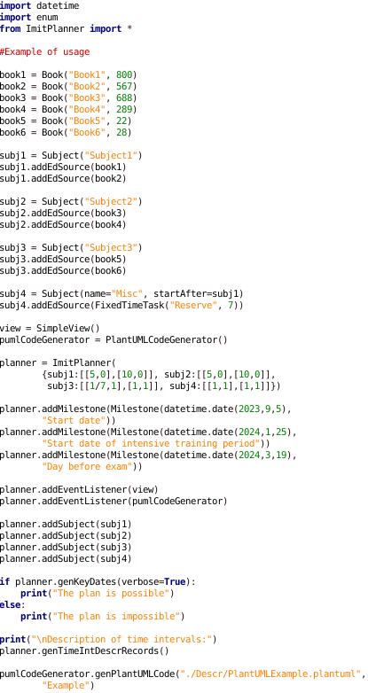
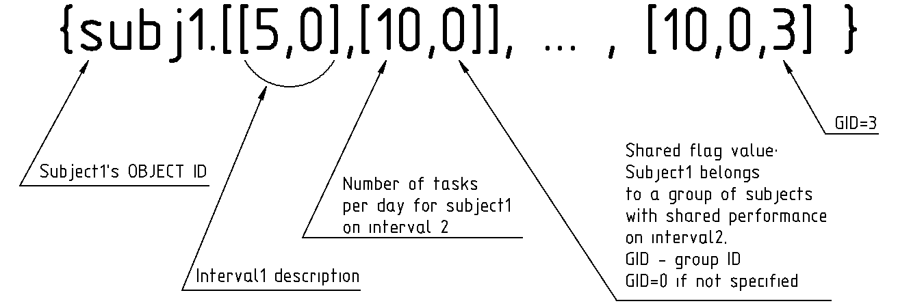
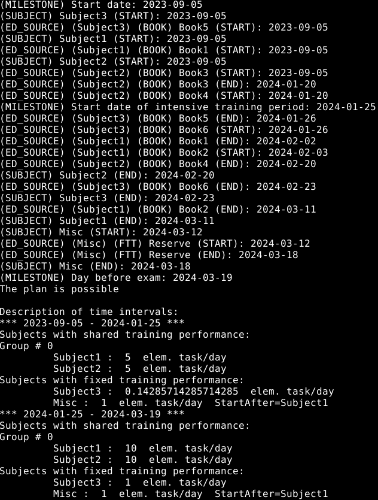

# ImitPlanner: open-source Python library for self-education and project management

**ImitPlanner** is an open-source cross-platform library under GPLv3 license that is intended for planning working time when performing a large number of tasks of approximately the same complexity (E. g., when preparing for exams on your own). It works on the principle of simulation.

## Dataflow diagram

The main library class is **ImitPlanner**. Diagram illustrating method **genKeyDates()** of that class from a functional point of view

## Class diagram

The **ImitPlanner** class is designed to fit into the **MVC** and **MVP** pattern. Key dates and description of time intervals are passed to the **SimpleView** class as messages (pattern **"Observer"**).

## Library code

The library code is presented in the [ImitPlanner.py](./ImitPlanner.py) file

## An example of usage

Exams in 3 subjects (subj 1, subj 2, subj 3) will be held on 2024-03-20. To prepare for them, you need to solve all the tasks from the books:

Preparation will start on September 5, 2023. For some time you will combine study with work and will be able to solve only 5 tasks per day in subject 1 and 2, and only 1 task per week in subject 3.  Then you will be able to devote all your time to studying and the productivity of preparation will increase. You also must keep one week in reserve.

You would also like that after completing the study of subject 1 or 2, the freed up resources would be directed to the study of the second subject. Since item 3 is relatively easy and the resources involved in studying it are insignificant, then after the completion of its study, they do not need to be redirected anywhere.

### Main questions

1. Is there enough time to complete the plan?
2. If enough, then what dates should you focus on when doing it?

### Example of code

[Example of code](./Example.py)

### Description of the training modes setting format

### Result

## Hot to use it?

1. Put the [ImitPlanner.py](./ImitPlanner.py) file in the same directory as your code
2. Add the following line to your code: `from ImitPlanner import *`
3. Write the code as shown above
4. You can create your own class, connect a GUI, etc.
5. Have fun!
